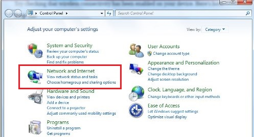
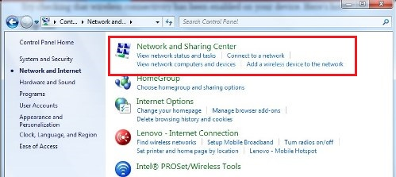
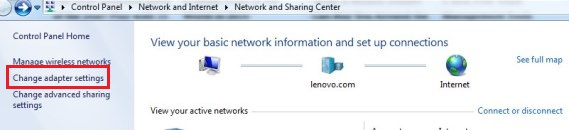
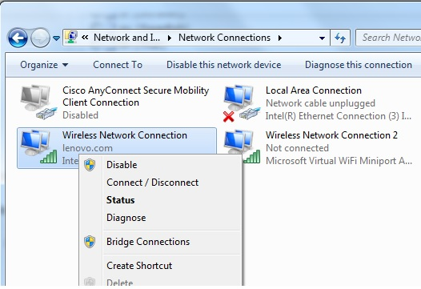

# Scan Protocol - 7T {#scan-protocol}

## Pre-Scan

### ASAP

-   Send participant COVID risk form
-   Send participant information sheet
-   Send participant consent/assent forms
-   Call participant for MRI safety screening (WBIC form)
-   Schedule tentative date for scan

### 1 Week Prior

-   Send WBIC the completed COVID risk form
-   Send WBIC the completed MRI safety screening (WBIC form)
-   Book scan session with WBIC ([bookings\@wbic.acm.ac.uk](mailto:bookings@wbic.acm.ac.uk){.email})
-   Schedule participant COVID safety screening call (must be 48 hrs prior to scan)

### 48 Hours Prior

-   Call participant for COVID safety screening
-   Make sure Teams App on phone and shift assigned for WBIC

### Night Before

-   Charge laptop
-   Plan to arrive 20 minutes early
-   Email participant reminder to arrive 15 minutes early

## Scan

### On Arrival

-   Check in to WBIC shift on Teams
-   Send message in teams COVID-19 channel "I'm here"
-   Tell receptionist you are scanning on 7T with your assigned Radiographer (Tracy)
-   Find place in lobby to sit
-   Have participant fill out MRI safety screening (again)
-   Load task on laptop (disinfect laptop - COVID protocol)
    -   Password - frith3
    -   [Disabling WiFi on Windows]
    -   Close all applications
-   Run practice task (approximately 5 minutes duration)
    -   Open MatLab
    -   Set current directory as task directory
    -   Type MID\_v9 and hit "Enter"
    -   Type participant id - pilot\_02
    -   Type "0" to run practice

### Practice Task Instructions

-   Explain task

> In this task, you are playing for real money! Your goal is to make as much money as possible! Each trial will begin with a cross. You will then see a star with a number inside. The number inside the star indicates how much money you can earn or lose on each trial. After each star you will see a white circle - followed by a white square. Your job is to respond to the white square by pressing the button as quickly as possible.

> If you press the button quick enough on a win trial, you will win the amount in the star. If you press the button quick enough on a lose trial, you will avoid losing the amount in the star. There are also some trials where you don't win or lose any money (0 pounds in the star). These are to make sure you are paying attention, so even though you won't win or lose any money on these trials be sure to press as fast as you can anyway. At the end of the game, the computer randomly picks out some of your trials for a real payment (up to 5 pounds) - so be sure to pay close attention and press the button as quickly as you can when you see the white square to earn as much as possible.

-   Have participant explain task back to you

### Scan Setup

-   Radiographer will assist participant into scanner
    -   Explain emergency squeeze ball, hearing protection, talking between each run
    -   Explain staying VERY STILL - even small movements will cause distortions
    -   Using button box to respond to task (press \#1)
-   Connect laptop
    -   To projector
    -   To trigger
    -   Plug in to power outlet
-   Setup task (should be setup from practice run)
-   If Cat not present, tell radiographer to cut one DTI sequence (keep the MB2\_iPAT2)

### Scanning

-   Scan sequences are saved in protocol at WBIC
-   Radiographer or researcher to check in with participant after each run
-   Anatomical scans first
-   Functional scans
    -   Type MID\_v9 and hit "Enter"
    -   Type participant id - pilot\_02
    -   Type "1" to run first run
    -   When complete run other 3 runs (\#2-4)

## Post Scan

-   Ask pilot participant (make notes)
    -   Was there anything they did not understand?
    -   Was there anything strange or different than expected?
    -   How were the timings? Were they fast, but long enough to understand?
-   Participant payment
    -   Tell participant will be paid 20 pounds for the scan plus what they win in the task
    -   Reimbursement for travel available if needed (tell participant to send the receipts)

### On Exit

-   Send message in teams COVID-19 channel "I'm leaving"
-   Backup behavioral data
-   Livia to download scan data from cluster

------------------------------------------------------------------------

## Troubleshooting

For help/advice please do not hesitate to contact the WBIC Radiographers [wbic-radiog\@lists.cam.ac.uk](mailto:wbic-radiog@lists.cam.ac.uk){.email}.

### Disabling WiFi on Windows

1.  Go to the Start Menu and select Control Panel
2.  Click the Network And Internet category\
    
3.  Select Networking and Sharing Center\
    
4.  From the options on the left-hand side, select Change adapter settings\
    
5.  Right click on Wireless Network Connection\
    
6.  Select "Disable"

### Finding the WBIC

-   Google WBIC and follow maps
-   There will be a roundabout near the hospital
-   Entrance to WBIC is at end of the street past the hospital
